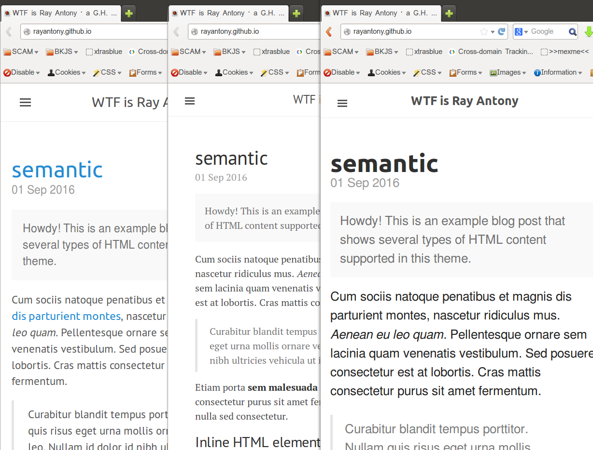

# [xtras](README.md)
===

#### Xtras is a dead-simple general purpose CSS Topcoat with Themes and Injection Kit 


Comparison from left to right of: XtrasBlu, without Xtras,and XtrasMedium as appplied to rayantony blog gh pages site.

](3facesofray.png "comparison of xtrasnew,original(themeless),and medinject (left to right) as appplied to rayantony blog gh pages site.")


### Usage is easy just pick one to add into your page


Here's the basic [Xtras](xtras.js)  version note that it does not inject other files and other than a loader there is no other .js so its completely free, easy, and safe to use. 
```<script src="//raymondanthony.github.io/xtras/xtras.js"></script>```


[XtrasBlu](xtrasblu.js) is nearly identical to vanilla xtras, with the primary differences being the opionated coloring whcich is a soft, agreeable tone with sparks of blue. It is for sprucing up my blog which has dead looking black links on black text which was well, too black. 
```<script src="//raymondanthony.github.io/xtras/xtrasblu.js"></script>```


[XtrasMedium](xtrasmedium.js)  is different and uses a special loader project and retrieves an alternate of the version of xtras found here as well as my own edit of skeleton and it imports medium css and js files too. So yeah, its different.
```<script src="//raymondanthony.github.io/xtras/xtrasmedium.js"></script>```


All these are bookmark loadable just add 'javascript:' to the beginning of the raw source and save the full string into the URL. 
>Note if it doesn't work file a bug with whoever built your browser they are all in their own way turning off address bar and bookmark loaded code to keep you supposedly safe from violently delightful animations and fonts :smile:


Latest vanilla Xtras [Xtras](xtras.js)
```js
(function(){var style=document.createElement('style'),styleContent=document.createTextNode('p,footer,header,a:link,article,soundmanager,video,input,post,h1,hr,h3{animation-delay:1.5s;animation:fly-in-from-right 0.93s 1s ease both;transform-origin:top right;}top-panels,h2,h4,h5,img,.bottom-panels,list-item,list,li,.list-group-item,ol,shop,dd,shop-button,shop-item,cart,ad,figure{animation-delay:1.8s;animation:fly-in-from-left 2.93s 1.2s ease both;-webkit-animation-delay:1.8s;-webkit-animation:fly-in-from-left 2.93s 1.5s ease both;transform-origin:top left;}@keyframes fly-in-from-top{from{transform:translateX(12rem) rotate(90deg);opacity:0;}}@keyframes fly-in-from-left{from{transform:translateY(12rem) rotate(180deg);opacity:0;}}@keyframes fly-in-from-right{from{transform:translateY(12rem) rotate(-360deg);opacity:0;}}frame,iframe,section{animation-delay:2s;animation:fly-in-from-left 2s 2s ease both;transform-origin:top left;}body{font-size:1.3em;line-height:1.5;font-weight:400;font-family:"Raleway","HelveticaNeue","Helvetica Neue",Helvetica,Arial,sans-serif;-apple-system,BlinkMacSystemFont,"Segoe UI",Roboto,Helvetica,Arial,sans-serif,"Apple Color Emoji","Segoe UI Emoji","Segoe UI Symbol";}*{box-sizing:border-box;}script{display:none;}html{font-family:"Raleway","HelveticaNeue","Helvetica Neue",Helvetica,Arial,sans-serif;font-size:23px;line-height:33.813px;margin-bottom:0px;margin-left:0px;margin-right:0px;margin-top:0px;overflow-x:hidden;overflow-y:scroll;padding-bottom:0px;padding-left:0px;padding-right:0px;padding-top:0px;-moz-box-sizing:border-box;color:rgba(0,0,0,0.88);}body{background-color:rgba(255,255,255,0.8);font-family:"Raleway","HelveticaNeue","Helvetica Neue",Helvetica,Arial,sans-serif;font-size:23px;font-style:normal;font-weight:400;letter-spacing:0px;line-height:33.813px;margin-bottom:0px;margin-left:0px;margin-right:0px;margin-top:0px;padding-bottom:0px;padding-left:0px;padding-right:0px;padding-top:0px;text-rendering:optimizelegibility;-moz-box-sizing:border-box;-moz-font-feature-settings:"liga";}.wrap{backface-visibility:hidden;font-family:"Raleway","HelveticaNeue","Helvetica Neue",Helvetica,Arial,sans-serif;font-weight:400;letter-spacing:0px;position:relative;text-rendering:optimizelegibility;transition-delay:0s;transition-duration:0.3s;transition-property:transform;transition-timing-function:cubic-bezier(0.42,0,0.58,1);-moz-box-sizing:border-box;-moz-font-feature-settings:"liga";}font-family:"PT Sans",Helvetica,Arial,sans-serif;font-weight:400;margin-bottom:10px;margin-top:30px;text-rendering:optimizelegibility;-moz-box-sizing:border-box;}font-family:"PT Sans",Helvetica,Arial,sans-serif;font-weight:400;text-rendering:optimizelegibility;-moz-box-sizing:border-box;font-style:normal;letter-spacing:0px;}btn{opacity:0;-webkit-transition:opacity 0.1s ease-in-out;transition:opacity 0.1s ease-in-out;-webkit-transform:translateZ();}#prs,#prs a:active,.kl:active,.link,.q:active,.tbotu,.w,a,a.gb1,a.gb2,a.gb3,div a:link,a:before,a:link{background-color:transparent;cursor:pointer;white-space:nowrap;-moz-text-decoration-line:none;-moz-text-decoration-style:solid;text-decoration:none;list-style:none;font-family:-apple-system,BlinkMacSystemFont,"Segoe UI",Roboto,Oxygen,Ubuntu,Cantarell,"Open Sans","Helvetica Neue",sans-serif;font-style:normal;font-weight:400;letter-spacing:0;text-rendering:optimizelegibility;-moz-font-feature-settings:"liga";}a:hover{text-decoration:underline;}ol,ul,dt{font-family:"PT Sans",Helvetica,Arial,sans-serif;font-weight:400;text-rendering:optimizelegibility;}input,button{whitespace:nowrap;}');style.appendChild(styleContent);var mexMeHead=document.getElementsByTagName('head');mexMeHead[0].appendChild(style);})();
```


[site](https://raymondanthony.github.io/xtras/)

[Main README](//github.com/raymondanthony/xtras/README.md)

by [@raymondanthony](@raymondanthony) [@rayrc](@rayrc) [@rayantony](@rayantony)


